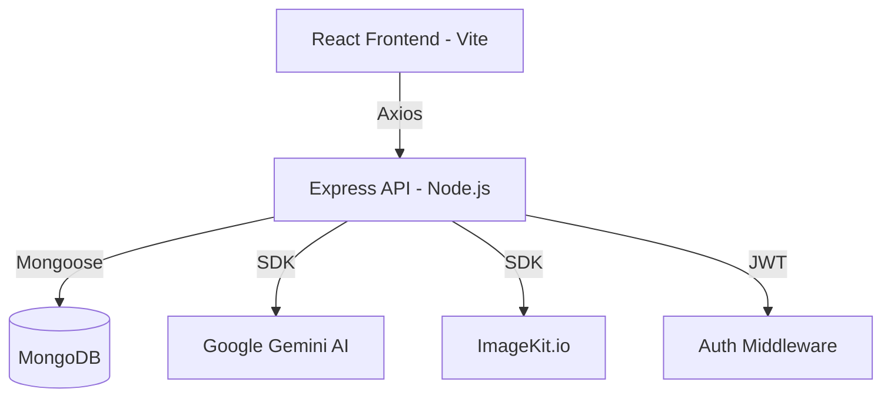

# CricBlog

**CricBlog** is a high-performance, cricket-centric blogging platform designed for seamless content creation and consumption. Built with a modern MERN stack and integrated with Google's Gemini AI, it provides fans with a premium reading experience and creators with intelligent writing assistance.

## 🚀 Overview

CricBlog bridges the gap between raw cricket data and engaging narratives. It offers a full-blown content management system (CMS) tailored specifically for cricket enthusiasts, featuring rich text editing, AI-powered drafting, and real-time interaction through a moderated commenting system.

### The Problem It Solves
Traditional blogging platforms are often bloated or lack domain-specific tools. CricBlog solves this by providing:
- **AI-Assisted Writing:** Overcome writer's block with integrated Gemini AI for content generation.
- **Optimized Media:** Automatic image compression and modern format conversion (WebP) via ImageKit integration.
- **Clean Engineering:** A decoupled architecture ensuring fast load times and smooth transitions.

## ✨ Key Features

- **AI Content Engine:** Leverage Google Gemini to generate blog drafts or refine existing content directly within the editor.
- **Rich Text Editing:** Full integration with Quill.js for professional-grade formatting.
- **Admin Dashboard:** A centralized hub to monitor performance metrics, manage blog posts, and moderate comments.
- **Modern UI/UX:** Built with Tailwind CSS 4 and Framer Motion for fluid animations and a responsive, mobile-first design.
- **Cloud Media Management:** Automated image uploads and transformations using ImageKit for optimal performance.
- **Secure Authentication:** Robust JWT-based authentication for administrative access.

## 🏗️ Architecture



## 🛠️ Tech Stack

### Frontend
- **Framework:** React 19
- **Build Tool:** Vite
- **Styling:** Tailwind CSS 4
- **Animations:** Framer Motion
- **State Management:** Context API
- **Routing:** React Router 7

### Backend
- **Runtime:** Node.js
- **Framework:** Express 5
- **Database:** MongoDB (Mongoose)
- **AI:** Google Generative AI (Gemini)
- **File Handling:** Multer + ImageKit

## 📦 Setup Instructions

1. **Clone the repository:**
   ```bash
   git clone https://github.com/Binada-Arachchige/CricBlog.git
   cd CricBlog
   ```

2. **Backend Setup:**
   - Navigate to the `server` directory.
   - Install dependencies: `npm install`
   - Create a `.env` file with the following:
     ```env
     PORT=5000
     MONGODB_URI=your_mongodb_uri
     JWT_SECRET=your_secret
     IMAGEKIT_PUBLIC_KEY=your_key
     IMAGEKIT_PRIVATE_KEY=your_key
     IMAGEKIT_URL_ENDPOINT=your_endpoint
     GEMINI_API_KEY=your_key
     ```
   - Start the server: `npm run server`

3. **Frontend Setup:**
   - Navigate to the `client` directory.
   - Install dependencies: `npm install`
   - Create a `.env` file:
     ```env
     VITE_API_BASE_URL=http://localhost:5000/api
     ```
   - Start the dev server: `npm run dev`


## 🔮 Future Improvements

- **Real-time Match Integration:** Pulling live scores and stats directly into blog posts.
- **User Profile Customization:** Allowing readers to follow specific authors or categories.
- **Enhanced AI Tools:** Automatic SEO tagging and readability analysis utilizing LLMs.

---

**Author:** Binada Matara Arachchige
[LinkedIn](https://linkedin.com/in/binada-m) | [Portfolio](https://binada.me) | [GitHub](https://github.com/Binada-Arachchige)
